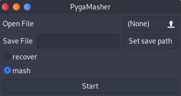

PygaMasher
=====

PygaMasher is a small program to convert any file into a video. It is designed to convert (mash) and
recover videos even after they were uploaded to an online video platform like YouTube.


### Dependencies
ffmpeg, libgtkmm-3.0-dev


### Getting started 
To compile and run PygaMasher execute the following commands:
```
mkdir build
cd build && cmake ../
make
cd ..
build/PygaMasher
```


### TODO
- Show progress to user
- Implement error correction
- Expose more settings to the user
